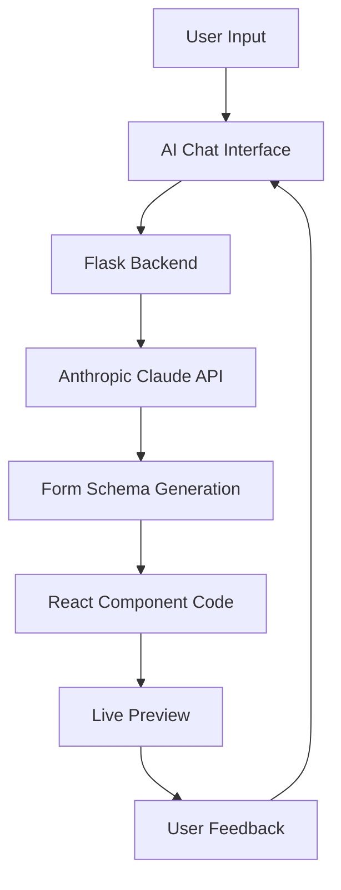

# 🤖 AI Form Creator

> **An intelligent form builder that transforms natural language descriptions into beautiful, functional React forms with validation**

[](https://github.com/ArieGoldkin/al-ui-components-creator/actions/workflows/ci.yml)
[](https://reactjs.org/)
[](https://www.typescriptlang.org/)
[](https://flask.palletsprojects.com/)
[](https://www.python.org/)
[](https://tailwindcss.com/)
[](https://opensource.org/licenses/MIT)
[](https://github.com/ArieGoldkin/al-ui-components-creator/actions/workflows/ci.yml)

## ✨ Features

- 🧠 **AI-Powered Generation**: Describe your form in natural language and watch it come to life
- 🎨 **Modern UI/UX**: Beautiful, responsive design with smooth animations and modern chat interface
- ⚡ **Real-time Preview**: See your form update instantly as you type
- 🔧 **Form Validation**: Built-in validation with Zod and React Hook Form
- 📱 **Responsive Design**: Works perfectly on desktop, tablet, and mobile devices
- 🎯 **TypeScript Support**: Full type safety throughout the application
- 🚀 **Fast Development**: Hot reload, instant resizing, and optimized build process
- 🎪 **Interactive Chat**: Modern message bubbles with animations and visual feedback

## 🚀 Quick Start

### Prerequisites

- **Node.js** >= 18.12.0 ([Download here](https://nodejs.org/))
- **pnpm** >= 8.0.0 (see installation instructions below)
- **Python** >= 3.9.0

#### Installing pnpm

Choose one of the following methods to install pnpm:

**Method 1: Using npm (recommended)**

```bash
npm install -g pnpm
```

**Method 2: Using corepack (Node.js 16.13+)**

```bash
corepack enable
corepack prepare pnpm@latest --activate
```

**Method 3: Using standalone installer**

```bash
curl -fsSL https://get.pnpm.io/install.sh | sh -
```

For more installation options, visit [pnpm.io/installation](https://pnpm.io/installation)

### Setup & Installation

#### Option 1: Automated Setup (Recommended)

1. **Clone the repository**

   ```bash
   git clone https://github.com/ArieGoldkin/al-ui-components-creator.git
   cd AiFormCreator
   ```

2. **Run the automated setup script**

   ```bash
   ./setup.sh
   ```

   This script will:

   - Check Node.js and Python versions
   - Install pnpm if not already installed
   - Set up the Python virtual environment
   - Install all dependencies (backend and frontend)

3. **Start the full-stack development environment**

   ```bash
   pnpm run dev
   ```

#### Option 2: Manual Setup

If you prefer to set up manually or the automated script fails:

1. **Clone the repository**

   ```bash
   git clone https://github.com/ArieGoldkin/al-ui-components-creator.git
   cd AiFormCreator
   ```

2. **Ensure you have the correct Node.js version**

   - If your Node.js version is < 18.12.0, upgrade from [nodejs.org](https://nodejs.org/)
   - Install pnpm: `npm install -g pnpm`

3. **Set up the project**

   ```bash
   pnpm run setup
   ```

4. **Start the development environment**

   ```bash
   pnpm run dev
   ```

This will start both the backend server (Python Flask) and frontend development server (React/Vite) concurrently.

## 📋 Available Scripts

### Development Scripts

| Script                       | Description                                          |
| ---------------------------- | ---------------------------------------------------- |
| `pnpm run dev`               | Start both backend and frontend servers concurrently |
| `pnpm run dev:fullstack`     | Same as `pnpm run dev`                               |
| `pnpm run dev:backend-only`  | Start only the Python Flask backend server           |
| `pnpm run dev:frontend-only` | Start only the React frontend development server     |
| `pnpm start`                 | Alias for `pnpm run dev`                             |

### Build & Preview Scripts

| Script                    | Description                          |
| ------------------------- | ------------------------------------ |
| `pnpm run build`          | Build the frontend for production    |
| `pnpm run build:frontend` | Same as `pnpm run build`             |
| `pnpm run preview`        | Preview the production build locally |

### Installation Scripts

| Script                      | Description                                                       |
| --------------------------- | ----------------------------------------------------------------- |
| `pnpm run setup`            | Complete project setup (creates venv + installs all dependencies) |
| `pnpm run install:all`      | Install dependencies for both backend and frontend                |
| `pnpm run install:backend`  | Install Python dependencies in virtual environment                |
| `pnpm run install:frontend` | Install Node.js dependencies for frontend                         |
| `pnpm run backend:setup`    | Create Python virtual environment and install backend deps        |

### Quality & Testing Scripts

| Script                   | Description                 |
| ------------------------ | --------------------------- |
| `pnpm run lint`          | Run ESLint on frontend code |
| `pnpm run lint:frontend` | Same as `pnpm run lint`     |
| `pnpm run lint:fix`      | Run ESLint with auto-fix    |
| `pnpm run test`          | Run frontend tests          |
| `pnpm run test:frontend` | Same as `pnpm run test`     |

### Maintenance Scripts

| Script                    | Description                                    |
| ------------------------- | ---------------------------------------------- |
| `pnpm run clean`          | Clean build artifacts and cache files          |
| `pnpm run clean:frontend` | Remove frontend node_modules and dist          |
| `pnpm run clean:backend`  | Remove Python **pycache** directories          |
| `pnpm run clean:all`      | Clean everything including virtual environment |
| `pnpm run reset`          | Complete reset: clean all + setup from scratch |

### Health Check Scripts

| Script                    | Description                            |
| ------------------------- | -------------------------------------- |
| `pnpm run check:health`   | Check if both servers are running      |
| `pnpm run check:backend`  | Check if backend server is responding  |
| `pnpm run check:frontend` | Check if frontend server is responding |
| `pnpm run logs:backend`   | View backend application logs          |

## 🏗️ Project Structure

```
AiFormCreator/
├── backend/                 # Python Flask backend
│   ├── app.py              # Main Flask application
│   └── requirements.txt    # Python dependencies
├── frontend/               # React frontend
│   ├── src/               # Source code
│   ├── public/            # Static assets
│   ├── package.json       # Frontend dependencies
│   └── vite.config.ts     # Vite configuration
├── augment/               # Python virtual environment
├── package.json           # Root package.json with unified scripts
└── README.md             # This file
```

## 🔧 Development Workflow

### First Time Setup

```bash
# 1. Clone and navigate to project
git clone <repository-url>
cd AiFormCreator

# 2. Complete setup
pnpm run setup

# 3. Start development
pnpm run dev
```

### Daily Development

```bash
# Start both servers
pnpm run dev

# Or start individually
pnpm run dev:backend-only    # Backend only
pnpm run dev:frontend-only   # Frontend only
```

### Before Committing

```bash
# Run linting and tests
pnpm run lint
pnpm run test

# Fix linting issues
pnpm run lint:fix
```

## 🌐 Server Information

- **Frontend Development Server**: http://localhost:3000
- **Backend API Server**: http://localhost:5001
- **Backend Health Check**: http://localhost:5001/health

## 🛠️ Troubleshooting

### Common Issues

1. **Node.js version too old**:

   - Error: `Node.js version X.X.X is too old`
   - Solution: Upgrade to Node.js >= 18.12.0 from [nodejs.org](https://nodejs.org/)
   - Check version: `node --version`

2. **pnpm not found**:

   - Error: `pnpm: command not found`
   - Solution: Install pnpm with `npm install -g pnpm` or use the automated setup script
   - Alternative: Use corepack with `corepack enable && corepack prepare pnpm@latest --activate`

3. **Port conflicts**: If ports 3000 or 5001 are in use, stop other services or modify the port configuration

4. **Python virtual environment issues**: Run `pnpm run clean:all && pnpm run setup` to recreate

5. **Node modules issues**: Run `pnpm run clean:frontend && pnpm run install:frontend`

6. **Backend not starting**: Ensure Python virtual environment is activated and dependencies are installed

### Reset Everything

```bash
pnpm run reset
```

This will clean all build artifacts, remove the virtual environment, and set up everything from scratch.

## 🎯 How It Works

1. **Describe Your Form**: Use natural language to describe what kind of form you need

   ```
   "Create a contact form with name, email, and message fields"
   "Make a signup form with password validation"
   "Build a registration form with dropdown options"
   ```

2. **AI Generation**: The AI processes your description and generates:

   - Form schema with proper field types
   - Validation rules using Zod
   - React component code with TypeScript

3. **Live Preview**: See your form rendered in real-time with:

   - Interactive form fields
   - Validation feedback
   - Responsive design
   - Modern styling

4. **Copy & Use**: Get the generated React component code ready to use in your projects

## 🏗️ Architecture



### Tech Stack

**Frontend:**

- ⚛️ **React 19.1.0** - Modern React with latest features
- 🔷 **TypeScript 5.8.3** - Type safety and better DX
- 🎨 **Tailwind CSS 3.4.0** - Utility-first CSS framework
- 📋 **React Hook Form 7.60.0** - Performant forms with validation
- ✅ **Zod 4.0.5** - TypeScript-first schema validation
- 🎭 **Lucide React** - Beautiful, customizable icons
- ⚡ **Vite 4.5.3** - Fast build tool and dev server

**Backend:**

- 🐍 **Python 3.9+** - Modern Python with type hints
- 🌶️ **Flask 2.3.3** - Lightweight web framework
- 🤖 **Anthropic Claude** - Advanced AI for form generation
- 🔄 **Flask-CORS** - Cross-origin resource sharing
- 🔐 **python-dotenv** - Environment variable management

## 🚀 CI/CD Pipeline

Our comprehensive GitHub Actions workflow ensures code quality and reliability:

### **Pipeline Features:**

- **🔄 Multi-Environment Testing**: Tests on Node.js 18.x & 20.x, Python 3.9-3.11
- **⚡ Parallel Execution**: Frontend and backend jobs run simultaneously
- **🗄️ Smart Caching**: pnpm and pip dependencies cached for faster builds
- **🔍 Code Quality**: ESLint, Prettier, Black, Flake8, and type checking
- **🧪 Comprehensive Testing**: Unit tests, integration tests, and security audits
- **📊 Build Verification**: Ensures both frontend build and backend startup work

### **Workflow Triggers:**

- Push to `main` branch
- Pull requests to `main` branch
- Push to feature branches (like `feature/ui-ux-modernization`)
- Manual workflow dispatch

### **Pipeline Jobs:**

1. **Frontend CI** - TypeScript type checking, ESLint linting, Prettier formatting, React build
2. **Backend CI** - Python code quality checks, Flask app validation, dependency testing
3. **Integration Tests** - Full-stack testing with real backend/frontend interaction
4. **Security Audit** - Dependency vulnerability scanning for both frontend and backend
5. **Build Summary** - Comprehensive pipeline status reporting

### **Status Monitoring:**

Check the current build status: [](https://github.com/ArieGoldkin/al-ui-components-creator/actions/workflows/ci.yml)

## 🎨 UI/UX Highlights

### Modern Chat Interface

- **Message Bubbles**: User messages on the right (blue), AI responses on the left (white)
- **Smooth Animations**: Fade-in and slide-in effects for new messages
- **Visual Feedback**: Typing indicators, loading states, and status updates
- **Responsive Design**: Adapts beautifully to different screen sizes

### Instant Sidebar Resizing

- **No Delay**: Resize starts immediately when dragging
- **Smooth Performance**: Optimized event handling for fluid interaction
- **Visual Cues**: Cursor changes and hover effects for better UX

### Form Preview

- **Real-time Updates**: See changes as you type your description
- **Interactive Elements**: Fully functional form fields with validation
- **Code Generation**: View the generated React component code
- **Copy to Clipboard**: Easy code copying with visual feedback

## 🔧 Configuration

### Environment Variables

Create a `.env` file in the `backend/` directory:

```env
# Required: Anthropic API key for AI form generation
ANTHROPIC_API_KEY=your_anthropic_api_key_here

# Optional: Flask configuration
FLASK_ENV=development
FLASK_DEBUG=true

# Optional: CORS settings
CORS_ORIGINS=http://localhost:3000
```

### API Key Setup

1. Get your Anthropic API key from [console.anthropic.com](https://console.anthropic.com/)
2. Add it to your `.env` file as shown above
3. Restart the backend server

## 🚀 Deployment

### Frontend (Vercel/Netlify)

```bash
# Build the frontend
pnpm run build

# The dist/ folder contains the built frontend
# Deploy the contents of frontend/dist/
```

### Backend (Railway/Heroku/DigitalOcean)

```bash
# Ensure requirements.txt is up to date
pip freeze > backend/requirements.txt

# Deploy the backend/ folder with your platform of choice
# Make sure to set the ANTHROPIC_API_KEY environment variable
```

## 🤝 Contributing

We welcome contributions! Here's how to get started:

1. **Fork the repository**
2. **Create a feature branch**: `git checkout -b feature/amazing-feature`
3. **Make your changes** and ensure they follow our coding standards
4. **Test your changes**: `pnpm run test && pnpm run lint`
5. **Commit your changes**: `git commit -m 'Add amazing feature'`
6. **Push to the branch**: `git push origin feature/amazing-feature`
7. **Open a Pull Request**

### Development Guidelines

- Follow TypeScript best practices
- Use Tailwind CSS for styling
- Write meaningful commit messages
- Add tests for new features
- Update documentation as needed

## 📄 License

This project is licensed under the MIT License - see the [LICENSE](LICENSE) file for details.

## 🙏 Acknowledgments

- **Anthropic** for providing the Claude AI API
- **React Team** for the amazing framework
- **Tailwind CSS** for the utility-first CSS framework
- **Vite** for the lightning-fast build tool
- **Open Source Community** for the incredible tools and libraries

---

<div align="center">

**Made with ❤️ by the AI Form Creator Team**

[Report Bug](https://github.com/ArieGoldkin/al-ui-components-creator/issues) · [Request Feature](https://github.com/ArieGoldkin/al-ui-components-creator/issues) · [Documentation](https://github.com/ArieGoldkin/al-ui-components-creator/wiki)

</div>
